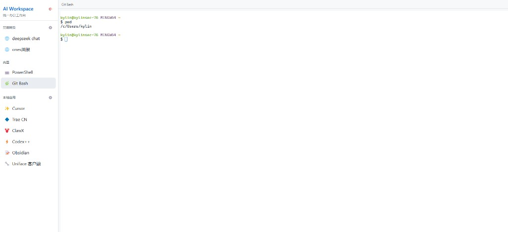

# AI Workspace

Windows 统一办公工作台（Electron）：把常用网页、内嵌终端、本地应用整合到一个窗口里。

## 预览

### 主界面 · 内嵌 Git Bash



左侧为导航区：常用网页、内置终端（PowerShell / Git Bash）、本地应用一键启动；右侧为工作区，可直接使用 Git Bash 等终端。

> 后续如有更多截图（暗色主题、网页 Tab、主题设置等），可继续放到 `docs/screenshots/` 并补充到本节。

## 功能

| 模块 | 说明 |
|------|------|
| 常用网页 | 最多 8 个，侧边栏 ⚙️ 配置，内嵌 Tab 打开 |
| 内置终端 | PowerShell、Git Bash，基于 xterm.js |
| 本地应用 | 自定义 exe / 快捷方式路径；已打开则窗口置前，不重复启动 |
| 主题设置 | 6 种配色（暗色 + 浅色），左上角 🎨 切换 |

## 快速开始

```bash
git clone git@github.com:zqDeJob/workstation.git
cd workstation
npm install
npm start
```

### 打包为桌面应用

```bash
npm run build
```

安装包输出在 `dist/` 目录。

## 配置与数据存储

所有个人配置保存在本机，**重启电脑不会丢失**：

| 内容 | 路径 |
|------|------|
| 常用网页 | `%APPDATA%/ai-workspace/websites.json` |
| 本地应用 | `%APPDATA%/ai-workspace/local-apps.json` |
| 主题 | `%APPDATA%/ai-workspace/settings.json` |

默认模板在 `config/` 目录：

- `websites.default.json` — 首次启动时的默认网页
- `local-apps.default.json` — 默认本地应用（Cursor、Trae、ClawX 等）
- `themes.json` — 可选主题定义

### 本地应用配置示例

每项只需 **名称** + **启动路径**（exe 或 .lnk 完整路径）：

```json
{
  "id": "cursor",
  "name": "Cursor",
  "icon": "✨",
  "path": "D:\\software\\cursor\\Cursor.exe"
}
```

## 说明

- 本地应用（Cursor、ClawX 等）以外部窗口启动，无法内嵌到本应用内
- 想恢复默认应用列表：删除 `%APPDATA%/ai-workspace/local-apps.json` 后重启

## 技术栈

- [Electron](https://www.electronjs.org/)
- [xterm.js](https://xtermjs.org/) + node-pty
- electron-builder（Windows 打包）

## License

MIT
